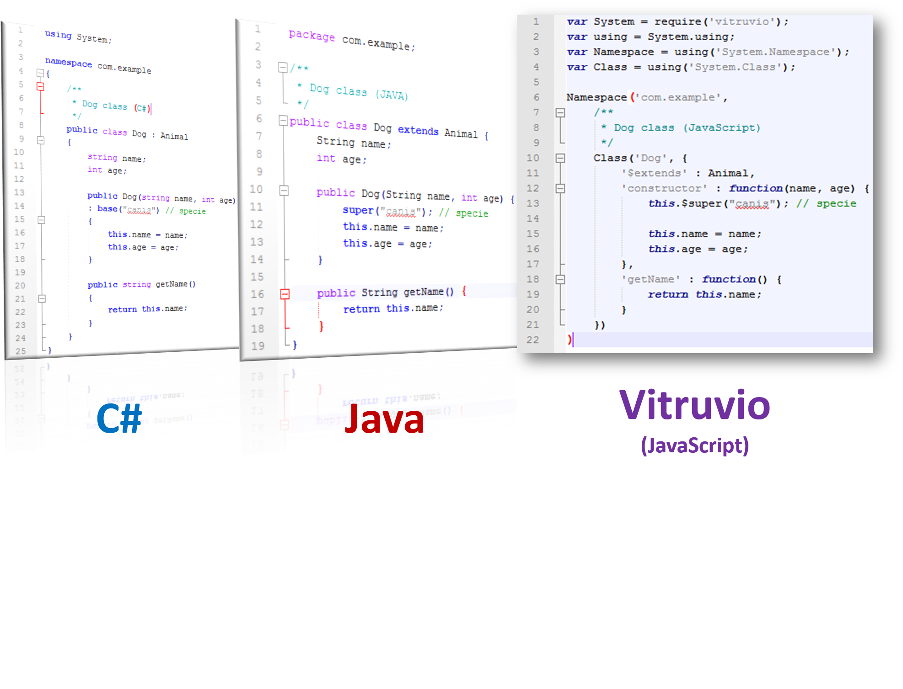

# 
# Vitruvio
Is a framework which extends JavaScript capabilities in order to allow developing OOP applications over an structural well designed architecture by defining: namespaces, classes, interfaces, enumerators, inheritance, exceptions and other resources. Altogether with the solid class system proposed, it offers an extensible Exception hierarchy, mixing functions, a resources loader system with high compatibility over web browsers and node js.  

## Environments and browser support
Vitruvio runs server side on Node.JS and client side suports the following browsers on desktop and mobile devices:
<ul>
<li> Google Chrome</li>
<li> Mozilla Firefox</li>
<li> Opera</li>
<li>
Safari</li>
<li> Internet Explorer</li>
<li> Microsoft Edge</li>
</ul>

