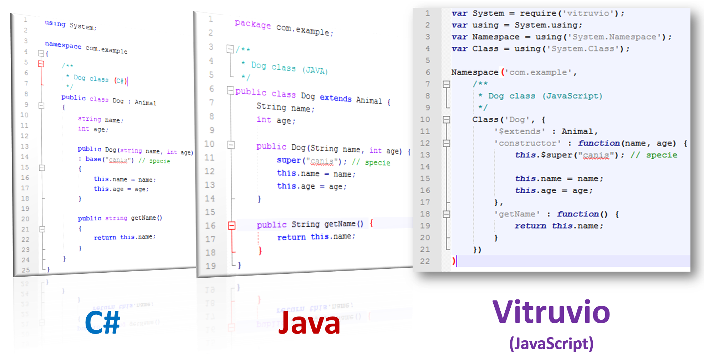

# 
# Vitruvio
Is a framework which extends JavaScript capabilities in order to allow developing OOP applications over an structural well designed architecture by defining: namespaces, classes, interfaces, enumerators, inheritance, exceptions and other resources. Altogether with the solid class system proposed, it offers:
<ul>
<li>An extensible Exception hierarchy</li>
<li>Event management system</li>
<li>Genericity checkouts over objects.</li>
<li>JXON and XML parser.</li>
<li>JSONP, AJAX and WebSocket client implementations</li>
<li>Basic DOM utility classes (Browser only).</li>
<li>A dynamic and extensible resources loader system highly compatible over web browsers and node js which allows customizations.</li>
<li>Cryptography encoder/decoder (UTF8, Base64).</li>
</ul>

## Environments and browser support
Vitruvio runs server side on Node.JS and client side suports the following browsers on desktop and mobile devices:
<ul>
<li> Google Chrome</li>
<li> Microsoft Edge</li>
<li> Mozilla Firefox</li>
<li> Opera</li>
<li>
Safari</li>
<li> Internet Explorer ver. 5+</li>
</ul>

## How to use
### Step 1, get it down!
Over NodeJS it can be easyly downloaded and installed with:
```console
npm install vitruvio --save
```
or can be downloaded from: [latest realeased](https://github.com/yadirhb/vitruvio/dist/vitruvio-latest.min.js)

### Step 2, include it in your code!
Vitruvio exports the System namespace which is the main namespace of the framework and contains fundamental classes and base classes that define commonly-used value and reference data types, events and event handlers, interfaces, attributes, and processing exceptions. For this reason is highly recommended to name it on source code as System.

On NodeJS using require:
```javascript
var System = require('vitruvio');
```

On html pages:
```html
<...>
<script type="text/javascript" src="./public/js/vitruvio/vitruvio.min.js"></script>
<script>
  // System is already loaded or you can use System.ready(function)
  System.ready(function(System) {
    // Do some cool things...
  })
</script>
<...>
```

### Step 3, get System's globals
```javascript
var using = System.using; // Resources solver function

// Main functions and resources
var Namespace = using('System.Namespace');
var Class = using('System.Class');
var Interface = using('System.Interface');
var Enum = using('System.Enum');
...
```

### Step 4, lets define!
```javascript
// on file src/com/example/Animal.js
Namespace('com.example', 
    /**
     * Animal class
     */
    Class('Animal', {
      'constructor' : function(specie) {
          this.specie = specie;
      },
      'getSpecie' : function() {
          return this.specie;
      }
    })    
)

// on file src/com/example/Dog.js
Namespace('com.example', 
    /**
     * Dog class
     */
    Class('Dog', {
      '$extends' : 'com.example.Animal',
      'constructor' : function(name, race, age) {
          this.$super('canis'); // initialize super constructor first
          this.name = name;
          this.race = race;
          this.age = age;
      },
      'getName' : function() {
          return this.name;
      },
      'getAge' : function() {
        ...
      },
      /**
       * @Override getSpecie
       */
      'getSpecie' : function() {
          return this.$super.getSpecie() + " - " + this.race;
      }
    })    
)

// on file src/main.js

var Dog = using('com.example.Dog'); // Reference the Dog class.

var boxer = new Dog("Snoopy", "Boxer", 5);

console.log(boxer.getName()) // Snoopy
console.log(boxer.getSpecie()) // canis - Boxer

```

